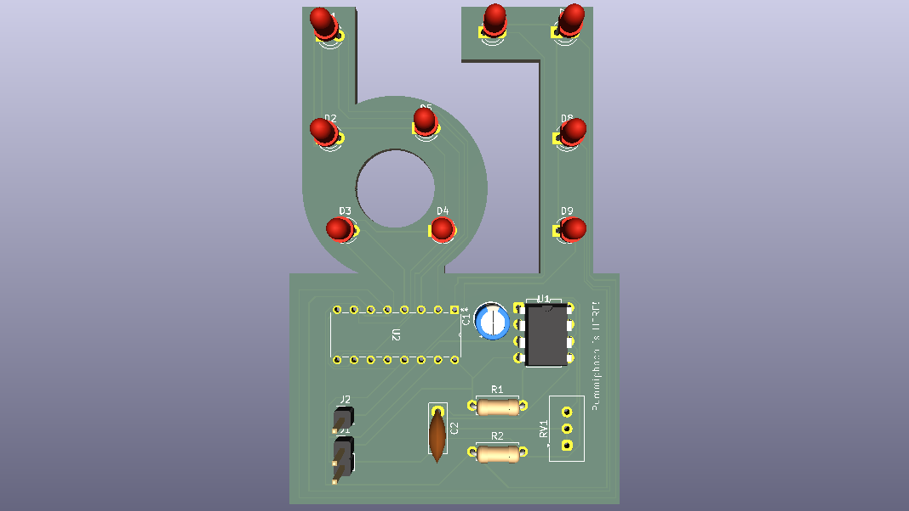

# 67-LED-CHASER
I created this project through a Stasis Hack Club workshop. It consists of nine LEDs, a resistor, a timer IC, an LED IC, a capacitor, and a potentiometer.
I plan to start designing PCBs with this project. I normally work on AI, machine learning, and related topics, so I'm excited to try something new.

## Bill of Materials (BOM)
| Item | Quantity | Notes | Price (Est. Total) |
|---|---|---|---|
| Custom PCB board | 1 | You can design this however you want! :) | $4.00 |
| LED | 9 | Depends on your design (approx. $0.10/each) | $0.90 |
| NE555P | 1 | Standard Precision Timer | $0.45 |
| CD4017 | 1 | Decade Counter | $0.55 |
| Female Header, 1x2 | 1 | Receptacle | $0.05 |
| Header, 1x1 | 1 | Male/Female (If you like to debug!) | $0.02 |
| 1uF Capacitor | 1 | Electrolytic | $0.10 |
| 0.01uF Capacitor | 1 | Ceramic Disc | $0.05 |
| 1kΩ Resistor | 1 | 1/4 Watt Metal Film | $0.02 |
| 470Ω Resistor | 1 | 1/4 Watt Metal Film | $0.02 |
| Potentiometer | 1 | Through-hole Trim Pot | $0.60 |
| Estimated Total |  |  | ~$6.76 |
